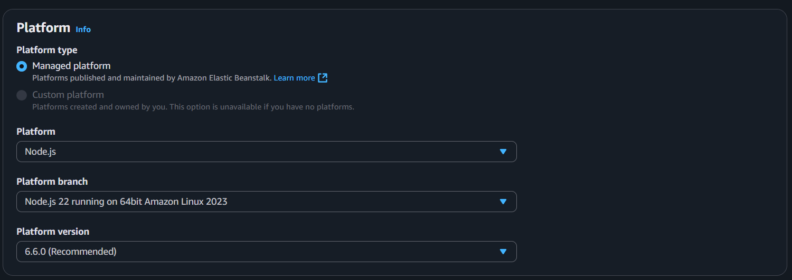
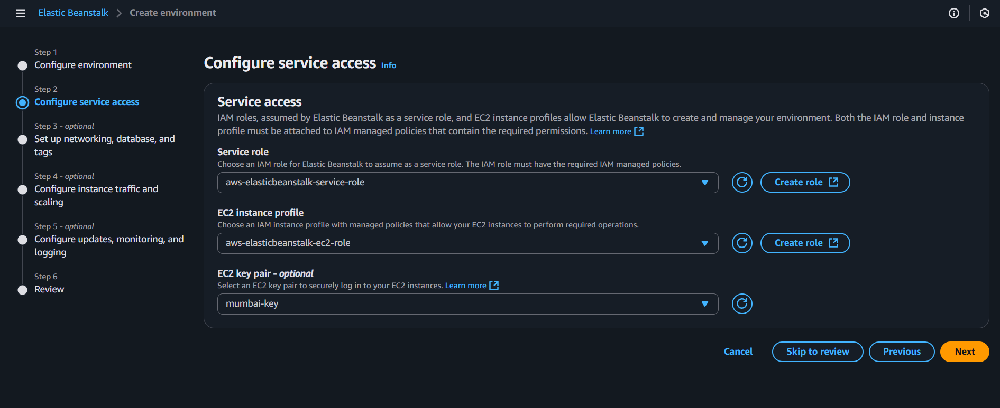
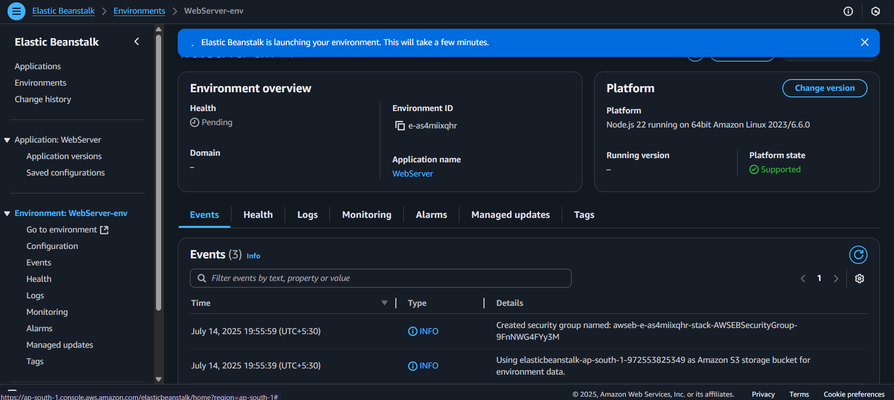
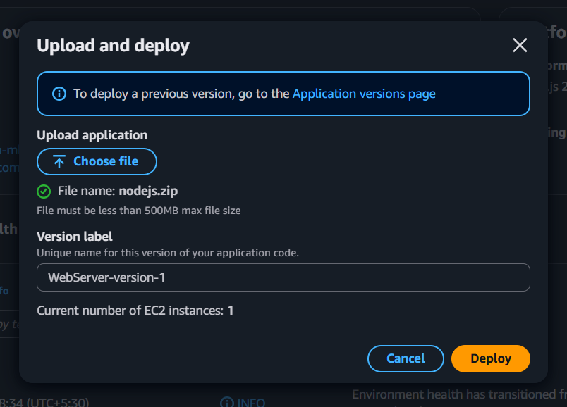
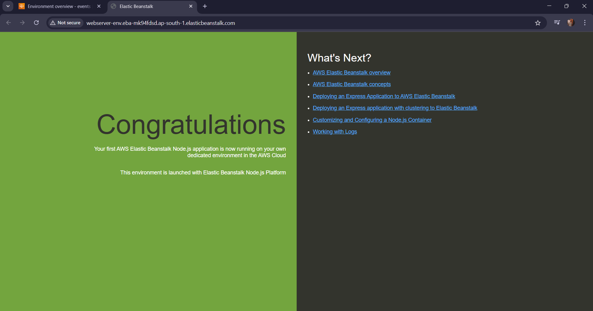

# Nodejs-ElasticBeanstalk

## Introduction:

This project demonstrates how to deploy a scalable Node.js web application using AWS Elastic Beanstalk, a fully managed service that handles the deployment, scaling, and health monitoring of your application automatically. By leveraging Elastic Beanstalk, developers can focus on writing code without worrying about infrastructure management. The application is packaged with all necessary dependencies and deployed to an environment where AWS provisions EC2 instances, load balancers, auto scaling groups, and more — all with minimal configuration.

This setup ensures high availability, flexibility, and ease of deployment, making it an ideal choice for modern web applications.

## Prerequsites:

- AWS free tier account.

- Node.js files

## Deployment Steps:

Step-1:

- Go to ElasticBeanstalk dashboard

- Create application

- Name as per your choice for application.

- Select platform as "Node.js"(Version will be selected latest  by default)

Step-2:

- Go to IAM service and create role as ElasticBeanstalk will need access of EC2 service.

- In roles give permissions as follows:

AWSElasticBeanstalkWebTier

AWSElasticBeanstalkWorkerTier

AWSElasticBeanstalkMulticontainerDocker

- Select ky pair and skip to preview and create environment.

Step-3:

- Environment will create all the required infrastructure on behalf of you.

Step-4:

- Now upload and deploy file from local machine (Node.js)

Step-5:

- Copy the endpoint to check deployment.

## Summary:

A Node.js web app deployed using AWS Elastic Beanstalk, featuring auto-scaling, load balancing, and managed EC2 instances. The project demonstrates cloud-native deployment with minimal configuration using the EB CLI, and optionally integrates S3 for static files and RDS for databases.
